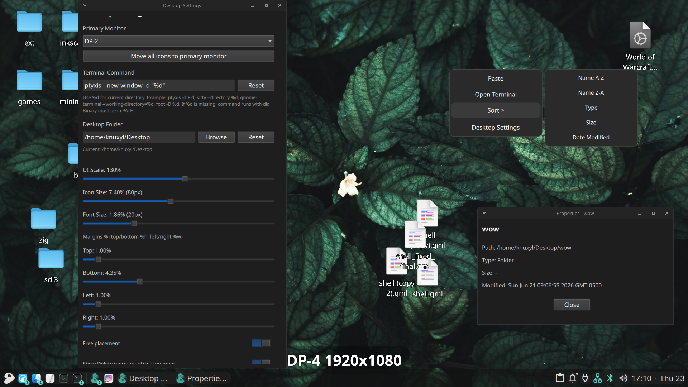
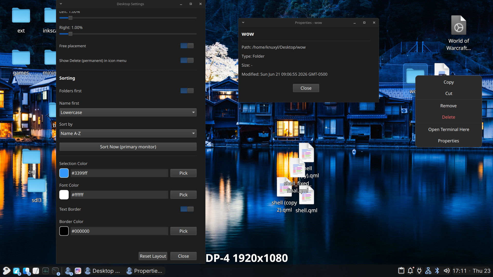

# Quickshell Desktop Icons
All coding was done by AI.

It isn't a **DESKTOP** environment if it doesn't have icons. It is a **WINDOW** environment. You place things on your desktop, not just paint it, otherwise it wouldn't be a desk, would it?

## Define desktop:

*The American Heritage® Dictionary of the English Language, 5th Edition.*

 - The area of a display screen where images, windows, **icons** and
   other graphical items appear.
   
*Wiktionary*
 - The main graphical user interface of an operating system, usually
   displaying **icons**, windows and background wallpaper.
   
*WordNet 3.0*
 - (computer science) the area of the screen in graphical user
   interfaces against which **icons** and windows appear.

## Features

 - Multiple monitors
 - Cut/Copy/Paste
 - Grid and Freeform placement
 - Comprehensive settings window
 - Use any folder as desktop
 - Percentage based sizing + positioning
 - Z-axis for use with freeform placement
 - Customizable open in terminal option

## Missing features/bugs

 - Drag and drop across file managers + moving into folders
 - Icon disappears briefly after dropping
 - Context menu sizing
 - Open and Open With
 - .desktop icon loading
 - Refresh option
 - Settings might be overwritten when changing desktop folder
 - Saved profiles

## Profiles

Profiles are saved dynamically by a hash of all monitor names + the absolute path to the selected desktop folder in ~/.config/qdi/HASH.json. These profiles save all settings, such as icon placement, z-axis, sizing, etc. NOTE AI broke this, this is no longer true.

# Installation

## Requirements

 - Quickshell
 - wl-clipboard
 - 
## Steps

 - Place the qdi folder in `~/.config/quickshell/`
 - Run with `qs -c qdi`
